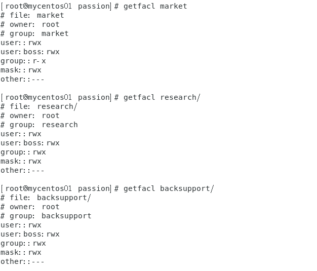

**一、Linux系统文件权限的管理**

1.建立市场部、后勤部、研发部

2.建立七个组员 A、B、C、D、E、F

将A、B归类为市场部，将C、D归类为研发部，将E、F归类为后勤部

3.建立市场部、研发部、后勤部的工作目录

4.将人员分组明确

5.展示人员名单

6.将三个组和新建的文件建立关系

7.将三个组内成员的权限修改为可读可写可执行

8.将老板的权限修改为所有权限

9.详细展示各分部的权限:

