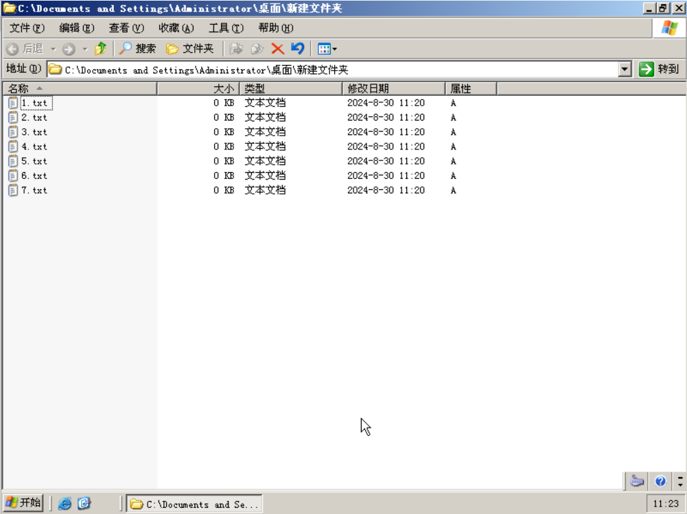

**一、Windows系统管理**

1.右击需要设置权限的文件，在弹出的快捷菜单中选择“属性”，弹出文件属性对话框，选
择“安全”选项卡

2.单击“安全”选项卡中的“高级”选项，弹出“高级安全设置对话框”选项卡

3.单击“添加”按钮，在弹出的对话框中单击“选择”主体，在弹出的“选择用户和组”对
话框中输入用户名并单击“检查名称”。

4.输入完成后，单击“确定”按钮，弹出如下图所示的权限项目对话框，选择分配给用户
everyone 的权限，并可以在右侧选择显示基本权限和高级权限。

5.

