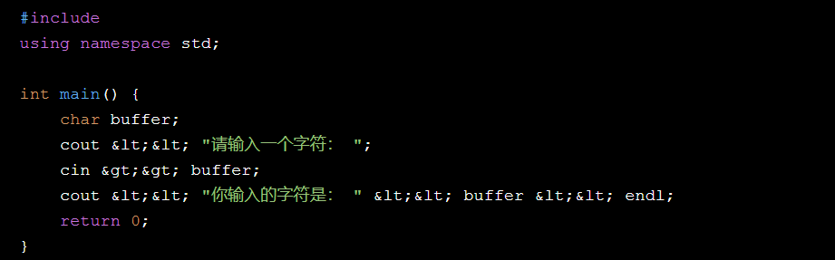
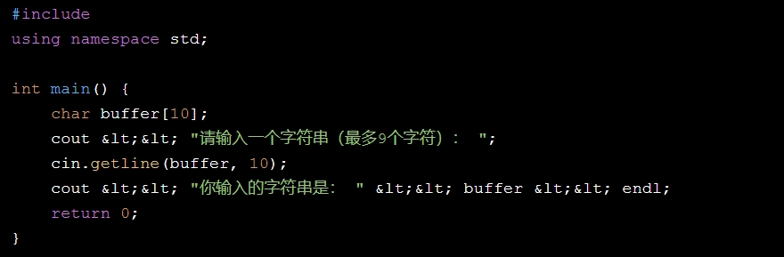
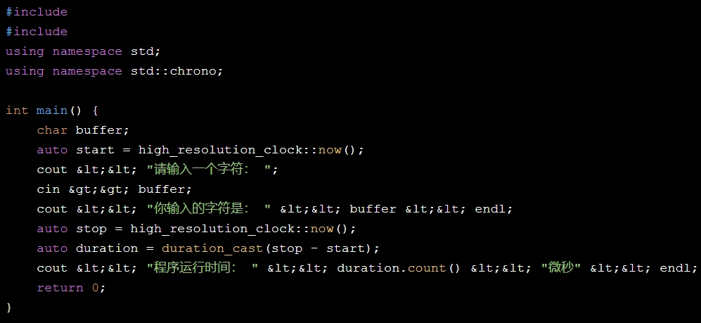
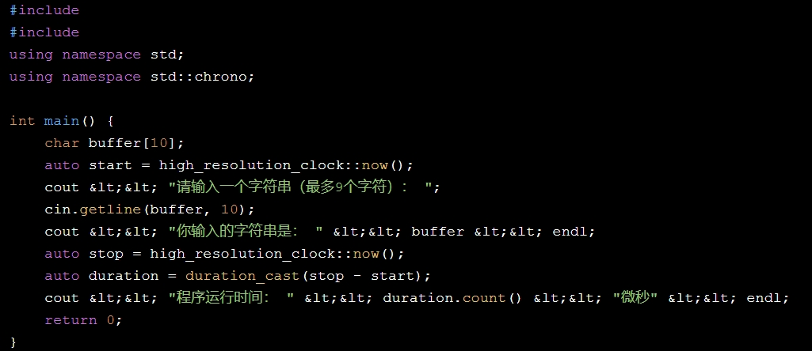
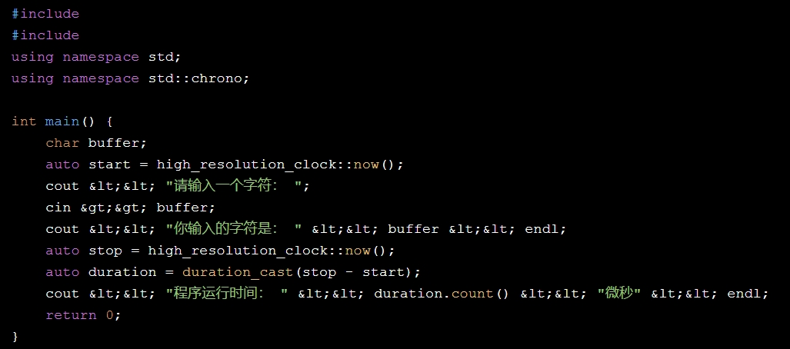
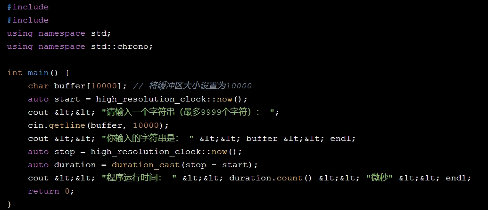

1 使用单字符作为缓冲区： 

2 使用数组作为缓冲区： 

3 要对比两个程序的运行时间，我们可以使用C++的``库来测量程序执行的时间。 

 （单字符缓冲区）： 

 （数组缓冲区）： 

4    编译并运行这两个程序，你将看到它们各自的运行时间。

5当缓冲区大小大于8192时，我们可以修改数组的大小来观察程序的行为。以下是两个版本的代码，分别使用更大的缓冲区：

（单字符缓冲区）：

 （数组缓冲区）： 

6    编译并运行这两个程序，你将看到它们各自的运行时间。由于缓冲区大小的增加，可能会影响程序的性能，因此请注意观察程序的运行时间是否有所变化。同样，为了获得更准确的结果，建议多次运行程序并计算平均运行时间。

| 小组成员 | 组内分工     | 组内打分 |
| -------- | ------------ | -------- |
| 付义博   | 文档编写     | 10       |
| 闫博     | 文档编写     | 10       |
| 梅泽荣   | 代码语句查找 | 10       |
| 张文轩   | 资料查找     | 10       |
| 柳少成   | 提供思路     | 10       |
| 谢锦锋   | 环境配置     | 10       |
| 李昊     | 无           | 1        |

