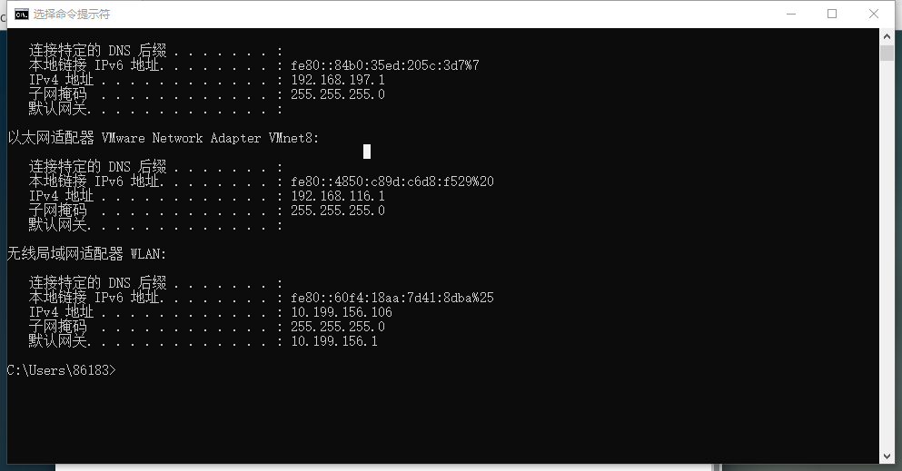
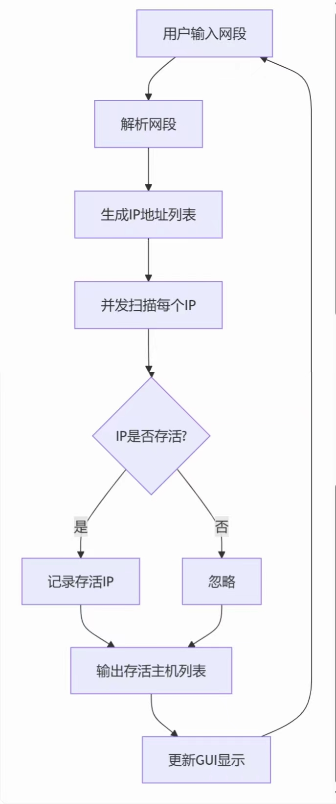

**1** 判断是否是同一个局域网 ， 判定 网络ID是否相同
IP = 网络ID + 主机ID
获得网络ID的方法 ： IP & 子网掩码 

**2**扫描本地主机IP地址

**3**未找到存活主机

**4**扫描过程

****

| 组内成员 | 组内分工         | 组内打分 |
| -------- | ---------------- | -------- |
| 柳少成   | 技术实现         | 120      |
| 张文轩   | 资料查找文档编写 | 120      |
| 梅泽荣   | 资料查找         | 120      |
| 付义博   | 编写文档         | 110      |
| 谢锦锋   | 技术实现         | 110      |
| 闫博     | 美化页面         | 110      |
| 李昊     | 无               | 1        |

