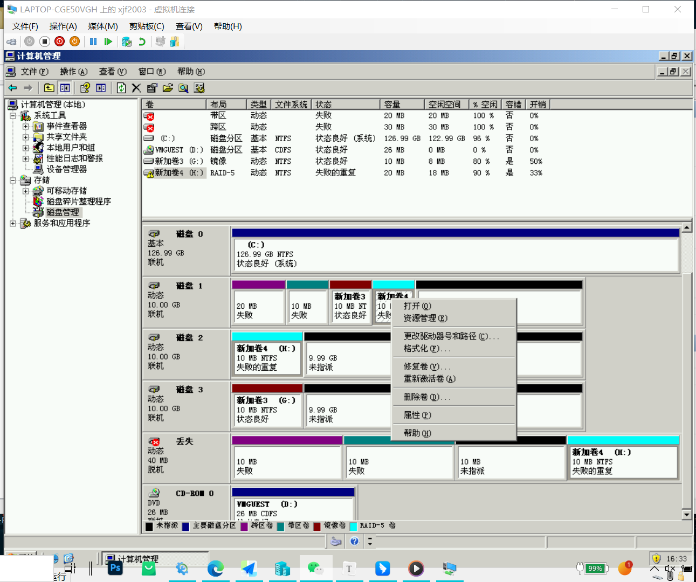

# **Windows**

**1.**新建四个磁盘，将四个磁盘转换成动态磁盘

**2.**创建跨区卷、带区卷、镜像卷、RAID-5卷

**3.**在每个卷中创建一个文件，将虚拟机关机，直接删除磁盘，再次打开虚拟机，发现磁盘1损坏

**4.**修复镜像卷

**5.**修复RAID-5卷

**6.**设置镜像卷，创建一个新用户，限制配额

**7.**创建一个高于限额的文件，并查看是否有日志提醒

**8.**注销administrator，登录新用户，发现无法创建超过配额的文件

#  **Linux学习之LVM文件系统** 

使用命令cfdisk -l 查看磁盘有没有分好：

[root@localhost ~]# fdisk -l

Disk /dev/sda: 128.8 GB, 128849018880 bytes

255 heads, 63 sectors/track, 15665 cylinders

Units = cylinders of 16065 * 512 = 8225280 bytes

Sector size (logical/physical): 512 bytes / 512 bytes

I/O size (minimum/optimal): 512 bytes / 512 bytes

Disk identifier: 0x00073570

Device Boot Start End Blocks Id System

/dev/sda1 * 1 26 204800 83 Linux

Partition 1 does not end on cylinder boundary.

/dev/sda2 26 7859 62914560 8e Linux LVM

Disk /dev/sdb: 107.4 GB, 107374182400 bytes

255 heads, 63 sectors/track, 13054 cylinders

Units = cylinders of 16065 * 512 = 8225280 bytes

Sector size (logical/physical): 512 bytes / 512 bytes

I/O size (minimum/optimal): 512 bytes / 512 bytes

Disk identifier: 0x00000000

Device Boot Start End Blocks Id System

/dev/sdb1 1 1245 10000431 8e Linux LVM
3个Linux LVM类型的分区已经创建好

/dev/sdb2 1246 2490 10000462+ 8e Linux LVM

/dev/sdb3 2491 3735 10000462+ 8e Linux LVM

**1.创建成pv**

[root@localhost ~]# pv
在命令行模式下输入pv,然后点击2下TAB键，可以看到很多关于pv的命令

pvchange pvcreate pvmove pvresize pvscan  上面所介绍的只是常用的命令

pvck pvdisplay pvremove pvs pv.sh

[root@localhost ~]# pvcreate /dev/sdb1    创建分区sdb1为pv

Physical volume "/dev/sdb1" successfully created

[root@localhost ~]# pvdisplay /dev/sdb1
查看刚创建pv的属性信息

"/dev/sdb1" is a new physical volume of "9.54 GiB"

--- NEW Physical volume ---

PV Name /dev/sdb1

VG Name

PV Size 9.54 GiB

Allocatable NO

PE Size 0

Total PE 0

Free PE 0

Allocated PE 0

PV UUID fqjlqY-0cEX-F2Pm-l2iN-S26j-TU8r-YRw21Q

[root@localhost ~]#

**2.创建vg**

[root@localhost ~]# vgcreate -s 16m myvg /dev/sdb{1,2}
将分区sdb1和sdb2创建为一个vg设置其块大小为16M 名称为myvg

Physical volume "/dev/sdb2" successfully created

Volume group "myvg" successfully created

[root@localhost ~]# vgdisplay
查看vg信息

--- Volume group ---

VG Name myvg
vg名称

System ID

Format lvm2

Metadata Areas 2

Metadata Sequence No 1

VG Access read/write

VG Status resizable

MAX LV 0

Cur LV 0

Open LV 0

Max PV 0

Cur PV 2

Act PV 2

VG Size 19.06 GiB
vg大小

PE Size 16.00 MiB
块大小

Total PE 1220

Alloc PE / Size 0 / 0

Free PE / Size 1220 / 19.06 GiB

VG UUID AOgwbS-fZJ7-dmr2-CgYd-rVpr-m1PB-ZjAzyF

**3.把myvg的大小扩大，可以使用命令vgextent**

[root@localhost ~]# vgextend myvg /dev/sdb3 

将刚才我们创建的另外一个sdb3分区加到myvg中去

Physical volume "/dev/sdb3" successfully created

Volume group "myvg" successfully extended

[root@localhost ~]# vgdisplay myvg
查看myvg的属性

--- Volume group ---

VG Name myvg

System ID

Format lvm2

Metadata Areas 3

Metadata Sequence No 2

VG Access read/write

VG Status resizable

MAX LV 0

Cur LV 0

Open LV 0

Max PV 0

Cur PV 3

Act PV 3

VG Size 28.59 GiB
 myvg的大小增加了

PE Size 16.00 MiB

Total PE 1830

Alloc PE / Size 0 / 0

Free PE / Size 1830 / 28.59 GiB

VG UUID AOgwbS-fZJ7-dmr2-CgYd-rVpr-m1PB-ZjAzyF

**4.创建lv**

[root@localhost ~]# lvcreate -L +10G -n mylv myvg
创建lv指明大小我10G名称为mylv的逻辑卷，卷组为myvg

Logical volume "mylv" created

[root@localhost ~]# lvdisplay
查看mylv的属性

--- Logical volume ---

LV Path /dev/myvg/mylv
逻辑卷mylv的路径

LV Name mylv
逻辑卷的名称

VG Name myvg
基于myvg卷组

LV UUID Oy1LMH-MqmN-pGfJ-Byfn-hVlW-lJZs-m7eXll

LV Write Access read/write

LV Creation host, time localhost, 2015-08-28 09:49:55 +0800

LV Status available

 # open 0

LV Size 10.00 GiB
大小为10G

Current LE 640

Segments 2

Allocation inherit

Read ahead sectors auto

-currently set to 256

Block device 253:4

**5.挂载和使用逻辑卷**

对创建的逻辑卷创建文件系统

[root@localhost ~]# mke2fs -t ext4 /dev/mapper/myvg-mylv
创建mylv的文件系统为ext4

mke2fs 1.41.12 (17-May-2010)

Filesystem label=

OS type: Linux

Block size=4096 (log=2)

Fragment size=4096 (log=2)

Stride=0 blocks, Stripe blocks

655360 inodes, 2621440 blocks

131072 blocks (5.00%) reserved for the super user

First data block=0

Maximum filesystem blocks=2684354560

80 block groups

32768 blocks per group, 32768 fragments per group

8192 inodes per group

Superblock backups stored on blocks:

32768, 98304, 163840, 229376, 294912, 819200, 884736, 1605632

Writing inode tables: done

Creating journal (32768 blocks): done

Writing superblocks and filesystem accounting information: done

This filesystem will be automatically checked every 34 mounts or

180 days, whichever comes first. Use tune2fs -c or -i to override.

[root@localhost ~]#

**接下来挂载和使用**

[root@localhost ~]# mount /dev/mapper/myvg-mylv /mnt 

将mylv挂载到mnt目录下

[root@localhost ~]# cd /mnt

[root@localhost mnt]# ll
 查看mnt目录下的文件

drwx------ 2 root root 16384 Aug 28 10:00 lost+found

[root@localhost mnt]# df -h
查看现系统中所有的挂载设备，我们刚才挂载的mylvy已经显示了

Filesystem Size Used Avail Use% Mounted on

/dev/mapper/vg0-root 20G 287M 19G 2% /

tmpfs 238M 0 238M 0% /dev/shm

/dev/sda1 190M 28M 153M 16% /boot

/dev/mapper/vg0-usr 9.8G 1.9G 7.4G 21% /usr

/dev/mapper/vg0-var 20G 196M 19G 2% /var

/dev/mapper/myvg-mylv

9.8G 23M 9.2G 1% /mnt

[root@localhost mnt]#

**扩展mylv的大小**

[root@localhost ~]# lvextend -L +2G -n /dev/mapper/myvg-mylv
将mylv扩大2G

Size of logical volume myvg/mylv changed from 10.00 GiB (640 extents) to 12.00 GiB (768 extents).

Logical volume mylv successfully resized

[root@localhost ~]# df -h
查看mylv的大小

Filesystem Size Used Avail Use% Mounted on

/dev/mapper/vg0-root 20G 287M 19G 2% /

tmpfs 238M 0 238M 0% /dev/shm

/dev/sda1 190M 28M 153M 16% /boot

/dev/mapper/vg0-usr 9.8G 1.9G 7.4G 21% /usr

/dev/mapper/vg0-var 20G 196M 19G 2% /var

/dev/mapper/myvg-mylv

9.8G 23M 9.2G 1% /mnt
 所示这边mulv的空间并没有扩大

[root@localhost ~]# resize2fs /dev/mapper/myvg-mylv

扩展逻辑边界 (注：只对ext文件系统使用。这里也可以指定扩展逻辑边界大小，默认物理边界大小)

resize2fs 1.41.12 (17-May-2010)

Filesystem at /dev/mapper/myvg-mylv is mounted on /mnt; on-line resizing required
                    

old desc_blocks = 1, new_desc_blocks = 1

Performing an on-line resize of /dev/mapper/myvg-mylv to 3145728 (4k) blocks.

The filesystem on /dev/mapper/myvg-mylv is now 3145728 blocks long.

[root@localhost ~]# df -h 

再次查看mylv这时空间就变大成了12G了

Filesystem Size Used Avail Use% Mounted on

/dev/mapper/vg0-root 20G 287M 19G 2% /

tmpfs 238M 0 238M 0% /dev/shm

/dev/sda1 190M 28M 153M 16% /boot

/dev/mapper/vg0-usr 9.8G 1.9G 7.4G 21% /usr

/dev/mapper/vg0-var 20G 196M 19G 2% /var

/dev/mapper/myvg-mylv

12G 25M 12G 1% /mnt

