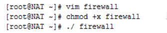
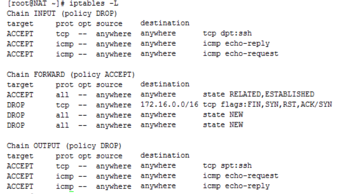

**一:环境构造**  
充当防火墙的机器是一台支持iptables的Linux系统，实验使用Centos6.5-i386装有三块网卡。

一台有三块网卡的Linux系统主机称为NAT：(作为网络防火墙)  
eth0 ： inet addr:10.33.1.142 (连接外网)  
eth1： inet addr:192.168.5.125(连接内网的DMZ区)  
eth2: inet addr:172.16.10.7 (连接内网的终端)  


根据实验拓扑图设置网络，使得主机NAT中eth0连上外网


内网中设定DMZ服务器的网络参数，将网关指向NAT主机的eth1


内网一台测试主机，网关指向NAT主机的eth2


**二：首先激活路由的转发功能**


设定iptables规则，写在shell脚本中并保存执行






**三：测试：（1）确保DMZ已经启动HTTP服务和FTP服务器：**


同时确保NAT主机上没有提供httpd和vsftpd服务


（2）测试内网主机172.16.10.8能否连接外网：


（3）测试内网主机172.16.10.8能否访问DMZ区中192.168.5.131的Web服务器：


（4）验证内网主机172.16.10.8能访问DMZ中192.168.5.131的FTP服务器：


（5）验证外网不能访问内网


（6）验证外网能访问DMZ中的FTP服务器：


（7）验证外网能访问DMZ中的WEB服务器：


（8）验证DMZ不可访问外网且不可访问内网


iptables脚本

```java
#!/bin/bash
modprobe ip_nat_ftp
```

把ip\_nat\_ftp模块载入内核，实现对nat，ftp的支持功能

```java
modprobe ip_conntrack_ftp
```

把ip\_conntrack\_ftp模块载入内核实现对ftp会话的跟踪

```java
iptables -F
iptables -F -t nat
iptables -F -t mangle
```

以上3条分别清空filter,nat和mangle3张表

```java
iptables -P INPUT DROP
iptables -P OUTPUT DROP
```

设定INPUT,OUTPUT 链的默认策略为DROP

```java
iptables -A INPUT -p tcp --dport 22 -j ACCEPT
iptables -A OUTPUT -p tcp --sport 22 -j ACCEPT
```

放行远程连接，这里为了方便使用X-shell远程连接，非必要策略

```java
iptables -A INPUT -p icmp --icmp-type 0 -j ACCEPT
iptables -A OUTPUT -p icmp --icmp-type 8 -j ACCEPT
iptables -A INPUT -p icmp --icmp-type 8 -j ACCEPT
iptables -A OUTPUT -p icmp  --icmp-type 0 -j ACCEPT
```

放行ping请求，方便测试网络是否连通

```java
iptables -t nat -A POSTROUTING -s 172.16.0.0/16 -o eht0 -j SNAT --to-source 10.33.1.142
```

内网需要自由地访问外网。在这一策略中，防火墙需要进行源地址转换。做SNAT，当位于内网网段172.16.0.0/16的客户机访问外网时，将其地址转换为10.33.1.142

```java
iptables -t nat -A PREROUTING -i eth2 -p tcp --dport 80 -j DNAT --to-destination 192.168.5.131
iptables -t nat -A PREROUTING -i eth2 -p tcp --dport 21 -j DNAT --to-destination 192.168.5.131
```

内网可以访问DMZ ，此策略是为了方便内网用户使用和管理DMZ中的服务器。

```java
iptables -A FORWARD -m state --state ESTABLISHED,RELATED -j ACCEPT
```

开放DMZ中ftp服务数据连接的被动传输模式

```java
iptables -A FORWARD -i eth0 -d 172.16.0.0/16 -p tcp --syn -j DROP
```

阻止外网主机直接以内网IP网段作为目标地址访问内网，一是为了安全，二是为了体现本例的nat功能

```java
iptables -t nat -A PREROUTING -i eth0 -p tcp --dport 21 -j DNAT --to-destination 192.168.5.131
iptables -t nat -A PREROUTING -i eth0 -p tcp --dport 80 -j DNAT --to-destination 192.168.5.131
```

外网可以访问DMZ ，DMZ中的服务器本身就是要给外界提供服务的，所以外网必须可以访问DMZ。同时，外\#网访问DMZ需要由防火墙完成对外地址到服务器实际地址的转换。

```java
iptables -A FORWARD -i eth1 -o eth0 -m state --state NEW -j DROP
```

DMZ不能访问外网 此条策略也有例外，比如DMZ中放置邮件服务器时，就需要访问外网，否则将不能正常工作

```java
iptables -A FORWARD -i eth1 -o eth2 -m state --state NEW -j DROP
```

DMZ不能访问内网 ,如果违背此策略，则当入侵者攻陷DMZ时，就可以进一步进攻到内\#网的重要数据。